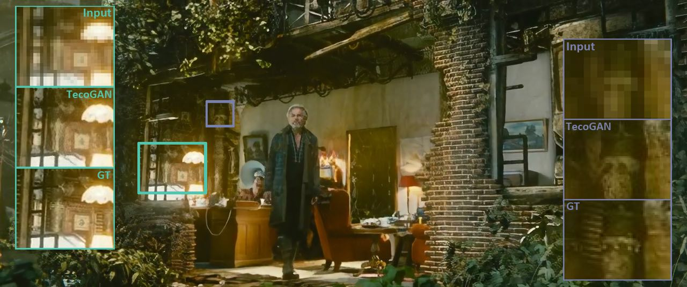

# TecoGAN
This repository contains source code and materials for the TecoGAN project, i.e. code for a TEmporally COherent GAN for video super-resolution.
_Authors: Mengyu Chu, You Xie, Laura Leal-Taixe, Nils Thuerey. Technical University of Munich._

This repository so far contains the code for the TecoGAN _inference_ 
and _training_. Data generation, i.e., download, will follow soon.
Pre-trained models are also available below, you can find links for downloading and instructions below.
The video and pre-print of our paper can be found here:

Video: <https://www.youtube.com/watch?v=pZXFXtfd-Ak>
Preprint: <https://arxiv.org/pdf/1811.09393.pdf>



### Additional Generated Outputs

Our method generates fine details that 
persist over the course of long generated video sequences. E.g., the mesh structures of the armor,
the scale patterns of the lizard, and the dots on the back of the spider highlight the capabilities of our method.
Our spatio-temporal discriminator plays a key role to guide the generator network towards producing coherent detail.

<br>

<br>

<br>

### Running the TecoGAN Model

Below you can find a quick start guide for running a trained TecoGAN model.
For further explanations of the parameters take a look at the runGan.py file.  
Note: evaluation (test case 2) currently requires an Nvidia GPU with `CUDA`. 
`tkinter` is also required and may be installed via the `python3-tk` package.

```bash
# Install tensorflow1.8+,
pip3 install --ignore-installed --upgrade tensorflow-gpu # or tensorflow
# Install PyTorch (only necessary for the metric evaluations) and other things...
pip3 install -r requirements.txt

# Download our TecoGAN model, the _Vid4_ and _TOS_ scenes shown in our paper and video.
python3 runGan.py 0

# Run the inference mode on the calendar scene.
# You can take a look of the parameter explanations in the runGan.py, feel free to try other scenes!
python3 runGan.py 1 

# Evaluate the results with 4 metrics, PSNR, LPIPS[1], and our temporal metrics tOF and tLP with pytorch.
# Take a look of the paper for more details! 
python3 runGan.py 2

```

### Train the TecoGAN Model

#### 1. Prepare the Training Data

...download scripts will follow soon...

#### 2. Train the Model  
This sections gives command to train a new TecoGAN model, 
detail and additional parameters can be found in the runGan.py file.  
Note: tensorboard gif summary relies on ffmpeg.

```bash
# Install ffmpeg for the  gif summary
sudo apt-get install ffmpeg # or conda install ffmpeg

# Train the TecoGAN model, based on our FRVSR model
# Please update the parameter VGGPath, using ./model/ by default, VGG model is 500MB
# Please update the testWhileTrain() function in main.py. It won't affect training, only try to test the newest model.
python3 runGan.py 3

# Train without Dst, (would be a FRVSR model)
python3 runGan.py 4

# View log on tensorboard
tensorboard --logdir='ex_TecoGANmm-dd-hh/log' --port=8008

```

### Tensorboard GIF Summary Example

<iframe width="100%" height="760" src="./gif_summary_example.html">
  <p>Your browser does not support iframes, try  <a href="./gif_summary_example.html">gif_summary_example</a>.</p>
</iframe>


### Acknowledgements
This work was funded by the ERC Starting Grant realFlow (ERC StG-2015-637014).  
Part of the code is based on LPIPS[1], Photo-Realistic SISR[2] and gif_summary[3].

### Reference
[1] [The Unreasonable Effectiveness of Deep Features as a Perceptual Metric (LPIPS)](https://github.com/richzhang/PerceptualSimilarity)  
[2] [Photo-Realistic Single Image Super-Resolution Using a Generative Adversarial Network](https://github.com/brade31919/SRGAN-tensorflow.git)  
[3] [gif_summary](https://colab.research.google.com/drive/1vgD2HML7Cea_z5c3kPBcsHUIxaEVDiIc)

TUM I15 <https://ge.in.tum.de/> , TUM <https://www.tum.de/>
